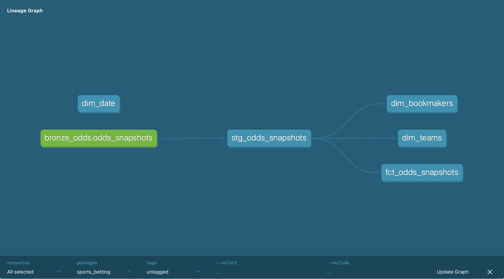

# Sports Betting Odds Data Pipeline

This repository is an **end-to-end data engineering portfolio project**: it ingests live sports betting odds from a public API, lands raw data in cloud object storage, refines it through a medallion-style lakehouse on Databricks, and exposes curated **Gold** analytics models through **dbt Core** against **Unity Catalog**. The goal is to demonstrate how modern batch pipelines combine orchestration, lakehouse patterns, and governed analytics; skills that translate directly to production analytics platforms.

---

## Architecture

High-level flow from ingestion through consumption:

```
                         +------------------+
                         |    Odds API      |
                         +--------+---------+
                                  ^
                                  | HTTPS (fetch odds)
                                  |
                         +------------------+
                         |  GitHub Actions  |
                         |  (ingest job)    |
                         +--------+---------+
                                  |
                                  | PUT JSON
                                  v
+------------------+     +------------------+     +------------------+
|  AWS S3 (Bronze) |---->| Databricks       |---->|  AWS S3 (Silver) |
|  raw JSON odds   |     | PySpark jobs     |     |  cleaned tables  |
+------------------+     +------------------+     +--------+---------+
                                  |                          |
                                  | register / write         |
                                  v                          v
                         +------------------+     +------------------+
                         | Unity Catalog    |<----| (managed tables  |
                         | (Bronze/Silver/  |     |  or external)    |
                         |  Gold metadata)  |     +------------------+
                         +--------+---------+
                                  |
                                  | dbt models (Gold)
                                  v
                         +------------------+
                         | dbt Core         |
                         | (Gold layer)     |
                         +--------+---------+
                                  |
                                  | semantic views / tables
                                  v
                         +------------------+
                         | Databricks SQL   |
                         | Warehouse        |
                         +------------------+
```

**How to read the diagram:** the API is the system of record for odds; GitHub Actions runs the Python ingest on a schedule; **Bronze** on S3 holds immutable raw payloads; **PySpark** on Databricks normalizes and writes **Silver** (often back to S3 or UC volumes); **Unity Catalog** provides centralized governance; **dbt** builds tested, documented **Gold** dimensional models; analysts and BI tools query via a **SQL Warehouse**.

---

## Tech Stack

| Area | Tools |
|------|--------|
| Ingestion & scripting | **Python** — `requests`, `boto3`, **pandas** (exploration / transforms where tabular workflows help) |
| Data lake | **AWS S3** — **Bronze** (raw) and **Silver** (refined) zones |
| Distributed processing | **Apache Spark / PySpark** on **Databricks** |
| Transformations & tests | **dbt Core** with the **Databricks** adapter |
| Governance | **Databricks Unity Catalog** (catalogs, schemas, access policies) |
| Orchestration | **GitHub Actions** — CI/CD and scheduled ingestion |
| Development | **LLM-assisted development** — **Claude**, **Cursor** (see note below) |

---

## Data Model (Gold)


The **Gold** layer is implemented as dbt models (see `dbt/sports_betting/models/`). At a glance:

| Model | Role |
|-------|------|
| **`dim_teams`** | **SCD Type 2** — preserves **history** of how a team appears over time (e.g. valid-from / valid-to / current flag). Franchise renames, relocations, or any attribute you treat as slowly changing can be modeled without losing the past. |
| **`dim_bookmakers`** | **SCD Type 1** — **overwrite** semantics: the latest bookmaker title and status win. Odds lines care about *current* book identity for reporting, not a full historical audit of marketing names. |
| **`dim_date`** | Calendar **date spine** from **2025-01-01** through **2027-12-31** for time-based analysis and joins without gaps. |
| **`fct_odds_snapshots`** | **Incremental** fact table: **one row per game / bookmaker / snapshot** (and related grain), suitable for trend and line-movement analysis at scale. |

**Why Type 2 for teams but Type 1 for bookmakers?**  
Team identity is a **dimension you may need to replay historically**—for example, comparing odds before and after a rebrand, or aligning facts to the correct entity at the time of the snapshot. Bookmaker metadata, in contrast, is often **corrected in place** in analytics: you usually want “what DraftKings is called *now*” on every row, not a full lineage of display names. Type 2 trades storage and join complexity for temporal truth; Type 1 keeps the model simple when history is not a business requirement.

---

## Pipeline Phases (Medallion)

- **Bronze** — **Raw, append-friendly** payloads (e.g. JSON as landed from the API). Schema-on-read; minimal transformation so you can always replay from source-shaped data.
- **Silver** — **Conformed, cleaned, and deduplicated** tables: standard types, parsing (timestamps, numerics), and a grain suitable for downstream modeling. This is where PySpark on Databricks does the heavy lifting.
- **Gold** — **Business-ready** star/snowflake-style models in dbt: dimensions, facts, tests, and documentation aimed at analysts and stable BI consumption via Unity Catalog and the SQL Warehouse.

---

## How to Run

### Prerequisites

- Python **3.12+** recommended  
- An [Odds API](https://the-odds-api.com/) key  
- AWS credentials with permission to write to your target **S3** bucket  
- (Optional for full lakehouse path) Databricks workspace, Unity Catalog, and a dbt profile for the Databricks adapter  

### Local Python ingestion

```bash
python -m venv .venv
source .venv/bin/activate   # Windows: .venv\Scripts\activate
pip install -r requirements.txt
cp .env.example .env        # fill in ODDS_API_KEY, AWS_*, S3_BUCKET_NAME
```

- **Fetch odds (NBA sample):** `python -m ingestion.fetch_odds`  
- **Upload Bronze JSON to S3:** `python -m ingestion.upload_to_s3`  

### GitHub Actions

Scheduled ingestion is defined in `.github/workflows/ingest_odds.yml`. Configure repository **Secrets** (`ODDS_API_KEY`, `AWS_ACCESS_KEY_ID`, `AWS_SECRET_ACCESS_KEY`, `AWS_REGION`, `S3_BUCKET_NAME`) so the workflow can run `python -m ingestion.upload_to_s3`.

### dbt (Gold)

From `dbt/sports_betting/` (after configuring `profiles.yml` for your Databricks SQL connection and Unity Catalog targets):

```bash
cd dbt/sports_betting
dbt deps          # if you add packages later
dbt run
dbt test
```

Ensure **Bronze** source objects exist where `sources.yml` expects them (e.g. `sports_betting.bronze.odds_snapshots`) before `stg_odds_snapshots` and downstream models will succeed.

---

## LLM-Assisted Development

Parts of this project were built faster with **Cursor** and **Claude** as coding assistants—boilerplate, scaffolding, YAML, and repetitive refactors. Calling that out is intentional: **pairing with LLMs for speed and exploration is increasingly normal** in data engineering, alongside the usual skills (data modeling, SQL, Spark, cloud, and operational discipline). The design choices, architecture, and review of generated code remain human-owned; the tools reduced friction, not judgment.

---

## License

Use and extend this project for learning and portfolio purposes; respect the Odds API and AWS terms of use for your own keys and workloads.
